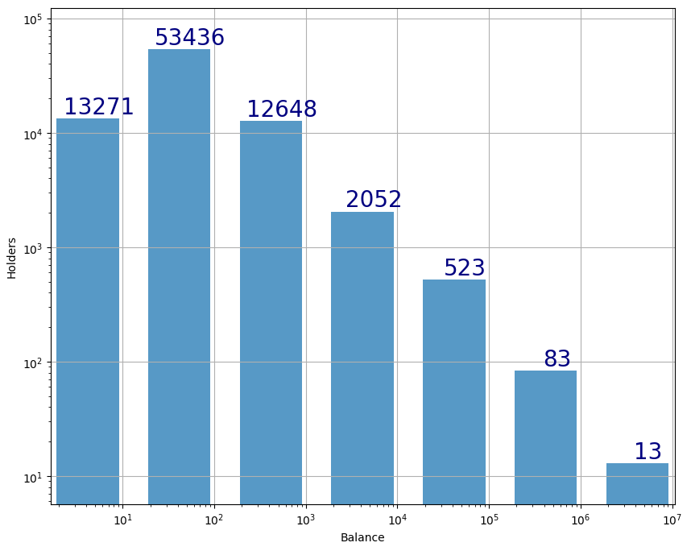

# TWT Holders
Brief glance at the distribution of TWT holders. See study.ipynb

Data has been downloaded from [bscscan](https://bscscan.com/token/0x4b0f1812e5df2a09796481ff14017e6005508003#balances) and has a limitation of 100k rows. However, it's more than enough to have a picture of tokens distribution across holders. Important to notice, that both X and Y scales are logarithmic. Holders that have less than 1 TWT are not presented.

Intervals are (1; 10], (10, 100], ... , (1M, 10M]

Last update: 2022-08-02

---
# TLDR: 

